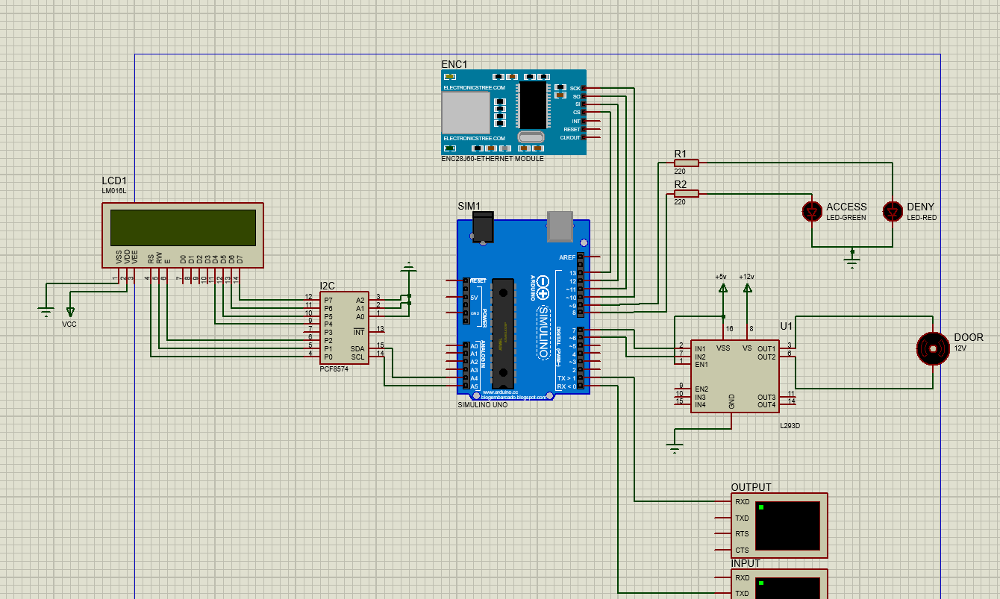
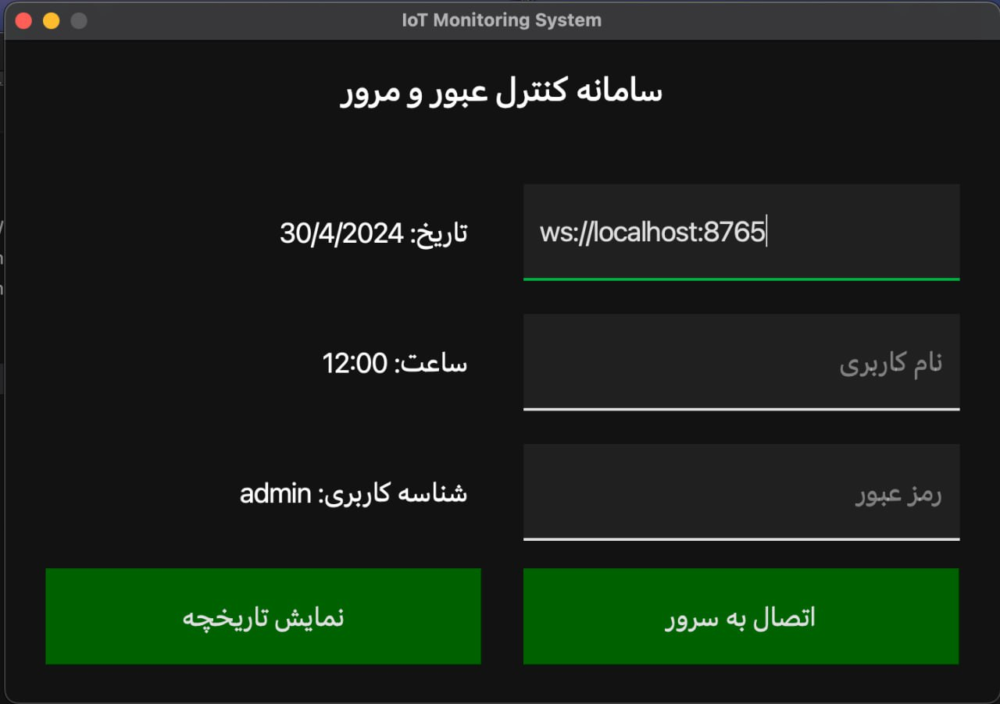
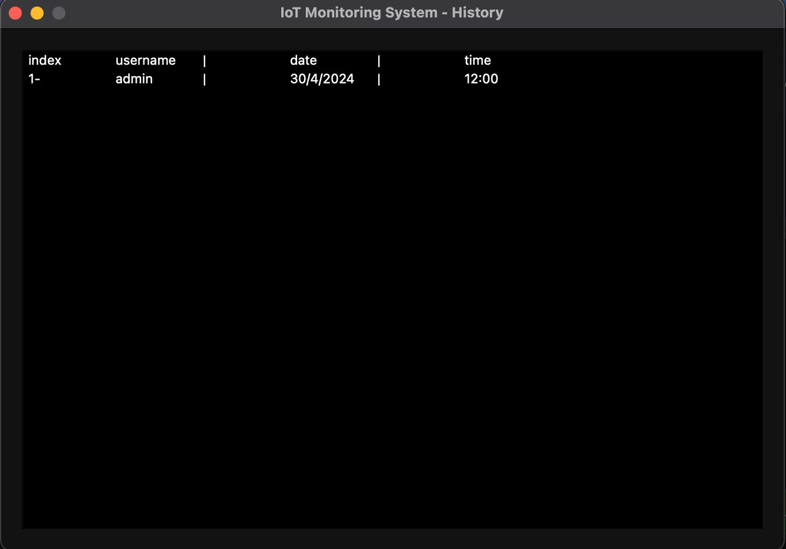

# Cyber Physical Systems: CA 1
In this CA an IOT system for a company's employees entrance implemented. The main goal of this system is to receive a tag (RFID tag), check the access, open the door if the owner of the tag has access and record date and time. The records are also stored in database and can be displayed.
The system is a combination of three subsystems connenting through HTTP request or web socket.
Each subsystem describes as follows:

## 1: Embedded System
The first subsystem includs a circuit of hardware components.


### Components:
#### 1: Arduino Uno Board
Manages componentes.
#### 2: Red and green LED
Green LED turns on if the RFID owner has access; else, red LED turns on.
#### 3: Door
A DC motor that turns right if the oppening signal issues. If it opens, turns left after the specified time and closes.
#### 4: LCD
Shows date and time, access info etc.
#### 5: Input and output terminals
Input gets rfid and output shows entered rfid when 10 digits entered completely.
#### 6: I2C
Works as master-slave and connects to LCD by 7 ports and connects to analog parts of arduino by 2 ports.
#### 7: Ethernet module
Wifi part simulation using loop back to send the request to a particular IP (192.168.2.2).

### Functions: Here are expleneation of some of the most important functions of this part
**User info struct:** this struct contains name, id, access state and access time and date <br>
**setup:** This function sets up the necessary components for RFID verification and communication <br>
**loop:** Repeatedly performs the following tasks:
Reads input (presumably from the terminal).
Processes Ethernet packets.
Checks input length and access status.
Sends RFID data to the server for verification.
Receives server responses.
Handles access control based on time and status.
Includes delays to avoid rapid toggling. <br>
**idealMode:** The idealMode() function resets the system to its default state for RFID verification. <br>
**sendRFIDtoServer:** Creates a stash (temporary storage) for the RFID data.
Constructs a JSON payload containing the RFID data.
Prepares an HTTP POST request with specific headers and the JSON payload.
Sends the request using Ethernet communication.
In summary, this function sends RFID data to a server for verification. <br>
**recieveServerResponse:** Retrieves the server response from the Ethernet library.
Parses the response to extract user information (date, RFID tag, time).
Sets the accessStatus based on whether the user is granted or denied access.
This function handles the server’s response after sending RFID data and updates the access status accordingly. <br>
**grantAccess:** Records the current time as the user’s access time.
Turns on the green LED (indicating access granted) and turns off the red LED.
Displays the user’s information on the LCD screen.
Opens the door by turning the DC motor 90 degrees to the right (if not already open).
This function ensures that authorized users are granted access and provides visual feedback through LEDs and the LCD display <br>
denyAccess: Turns on the red LED (indicating access denied) and turns off the green LED.
Displays “ACCESS DENIED” on the LCD screen.
Closes the door by turning the DC motor 90 degrees to the left (if the door is open).
This function ensures that unauthorized users are denied access and provides visual feedback through LEDs and the LCD display <br>


## 2: Cloud
This subsystem is a server that comunicates with the first and third subsystems and handles requests and sends responses and makes connection to the Arduiono using HTTP and to monitoring system using web socket.

**EntranceItme:** every login attempt is stored as an instance of entranceItem and contains rfid, date and time.<br>
```cpp
#ifndef ENTRANCEITEM_H
#define ENTRANCEITEM_H

#include <QJsonObject>
#include <QDateTime>
#include <QString>

class entranceItem
{
public:
    entranceItem(const QString& rfid_tag_, const QString& date_, const QString& time_);
    entranceItem(const QString& rfid_tag_);
    entranceItem(const QJsonObject& jsonObject);
    QString getRFID() const;
    QJsonObject toQJsonObject() const;

private:
    QString rfid_tag;
    QString date;
    QString time;
};

#endif // ENTRANCEITEM_H

```
**EntranceHistory:** a list of entrance items. Usage: sening log to monitoring system <br>
**httpServer:** The httpServer class represents an HTTP server that handles requests and responses. It listens on a specified port and interacts with an RFIDVerifier object. The request_handler method processes incoming HTTP requests and provides appropriate responses. 
```c
#ifndef HTTPSERVER_H
#define HTTPSERVER_H
#include <QHttpServerResponse>
#include <QHttpServerRequest>
#include <QJsonDocument>
#include <QHttpServer>
#include <QJsonObject>
#include <QJsonArray>
#include <QObject>

#include "RFIDVerifier.h"

class httpServer : public QObject
{
    Q_OBJECT
public:
    httpServer(int port_, RFIDVerifier* RFID_verifier_, QObject *parent = nullptr);
    ~httpServer();
    void start_server();
    void stop_server();
    QHttpServerResponse request_handler(const QHttpServerRequest& request);

private:
    int port;
    QHttpServer* server;
    RFIDVerifier* RFID_verifier;
};

#endif // HTTPSERVER_H
```
**RFIDVerification:** <br>
The RFIDVerifier class in this C++ header file manages RFID tag verification for system. It includes methods to check the validity of an entranceItem and emits signals based on verification results.
```c
#ifndef RFIDVERIFIER_H
#define RFIDVERIFIER_H

#include <QJsonDocument>
#include <QJsonObject>
#include <QJsonArray>
#include <QObject>
#include <QString>
#include <Qdebug>
#include <QFile>

#include "entranceItem.h"

class RFIDVerifier : public QObject
{
    Q_OBJECT
public:
    RFIDVerifier(const QString& tags_file_path_);
    bool verify(const entranceItem& entrance_item);

private:
    QString tags_file_path;
    QList<QString> rfid_tags;

Q_SIGNALS:
    void verified(entranceItem entrance_item);
    void not_verified(entranceItem entrance_item);
};

#endif // RFIDVERIFIER_H
```

**wsRequest:** The wsRequest class represents a request with a type (e.g., login or history) and associated data (stored as a JSON object). It provides methods to retrieve the request type and information.
```c
#ifndef WSREQUEST_H
#define WSREQUEST_H

#include <QObject>
#include <QJsonObject>

class wsRequest
{
public:
    enum class requestType {
        UserLogIn,
        RecordHistory,
        NoType
    };

    wsRequest(const QJsonObject& json_request);
    QJsonObject getRequestInfo() const;
    requestType getRequestType() const;

private:
    requestType req_type;
    QJsonObject req_info;
};

#endif // WSREQUEST_H

```
**wsResponse:**  The wsResponse class represents a response with a status code (e.g., 200 for success) and associated data (stored as a JSON document). It provides methods to retrieve the response type and convert it to a JSON document.
```c
#ifndef WSRESPONSE_H
#define WSRESPONSE_H

#include <QJsonDocument>
#include <QJsonObject>
#include <QJsonArray>
#include <QObject>

class wsResponse
{
public:
    enum class responseType {
        Ok = 200,
        BadRequest = 400,
        Unauthorized = 401,
    };

    wsResponse(responseType res_type_, const QJsonDocument& res_info_ = QJsonDocument());
    int getResponseType() const;
    QJsonDocument toJsonDocument() const;

private:
    responseType res_type;
    QJsonDocument res_info;
};

#endif // WSRESPONSE_H

```
**wsServer:** It manages WebSocket connections, including setup and disconnection and handles incoming messages from clients.
Emits signals for user login requests and history log retrieval,
notifies whether a client is verified or not and sends verified or unverified entrance data to clients.
```c
#ifndef WSSERVER_H
#define WSSERVER_H

#include "QtWebSockets/qwebsocket.h"
#include "QtWebSockets/qwebsocketserver.h"

#include <QJsonDocument>
#include <QJsonObject>
#include <QJsonArray>
#include <QString>
#include <QObject>

#include "entranceItem.h"
#include "wsResponse.h"
#include "wsRequest.h"

class wsServer : public QObject
{
    Q_OBJECT
public:
    wsServer(int ws_port_, QObject* parent = nullptr);

public Q_SLOTS:
    void set_up_connection();
    void disconnect_client();
    void handle_message(const QString& message);
    void send_message(const wsResponse& ws_response);
    void send_history(const QJsonArray& history_logs);
    void client_verified();
    void client_not_verified();
    void send_verified_entrance(const entranceItem& entrance_item);
    void send_not_verified_entrance(const entranceItem& entrance_item);

Q_SIGNALS:
    void user_login_requested(const QString& username, const QString& password);
    void logs_history_requested();

private:
    QWebSocketServer* server;
    QWebSocket* monitoring_client;
    int ws_port;
    bool client_has_access;
};

#endif // WSSERVER_H
```


## 3: Monitoring System

### Overview
This part provide a sophisticated graphical user interface (GUI) that allows users to connect to a server via WebSocket, manage session states, and visualize session data. The application handles realtime communication and dynamically updates the GUI with new information from the server.

### Key Components
#### Application (cpsapplication.h/cpp)
**Framework Initialization**: Initializes the application's main and history windows and sets global styles.</br>
**WebSocket Communication**: Manages WebSocket connections, handles errors, and processes incoming messages.</br>
This component is crucial for enabling real-time communication between the client application and a server using WebSockets. By establishing a WebSocket connection, the application can send and receive messages in a full-duplex manner, which means that both the server and the client can send data independently of one another at any time during the connection's lifecycle. Here's a detailed breakdown of how WebSocket communication is managed within the application:

**1-Establishing Connections**:<br>
When a user enters the WebSocket URL along with their credentials (username and password) and clicks the connect button, the application invokes the attemptConnection method. This method performs the following actions:

- Connection Check: It first checks if the WebSocket is not already connecting or connected. If it is neither, it initiates a new connection using the URL provided by the user.

- Signal Handling: The application connects various signals from the QWebSocket instance to appropriate slots within the Application class. These signals include:

    - **connected**: Triggered when the WebSocket connection is successfully established.

    - **disconnected**: Triggered when the WebSocket connection is closed, either intentionally or due to connection issues.

    - **textMessageReceived**: Triggered whenever a new text message is received over the WebSocket.
    - **errorOccurred**: Triggered when there is an error with the WebSocket communication.

**2-Handling Errors**:<br>
- Error handling is crucial for maintaining robust communication and providing a good user experience:

    - **Immediate Feedback**: If an error occurs during the WebSocket connection attempt or during communication, the errorOccurred signal is triggered. In response, an anonymous lambda function connected to this signal logs the error and can also be used to notify the user through the GUI.

    - **Error Logging**: The error details are logged using 'qDebug()' which helps in debugging and maintaining logs of communication issues.</br><br>

**3-Processing Incoming Messages**:<br>
The application listens for the textMessageReceived signal. When this signal is emitted:

- **Message Parsing**: Incoming messages are assumed to be in a JSON format. The processMessageReceived method parses these JSON messages.

- **Updating Application State**: Depending on the content of the JSON message, various parts of the application's state or user interface might be updated. For example, if the message contains user details, the application updates these details in the main window. If it contains historical data, it displays this data in the history window.

- **Error Handling in Messages**: If the JSON is invalid or unexpected, the method logs the anomaly for troubleshooting purposes.

**Message Processing**: Interprets JSON-formatted messages and updates the application state accordingly.

### MainWindow (cpsmainwindow.h/cpp)
**UI Setup**: Configures layouts, styles, and signal-slot connections.
**User Interaction**: Handles user inputs for server connection and displays updated user information.</br>
**Dynamic UI Updates**: Reflects changes in the user session status on the UI dynamically.</br>


### Usage
**Connecting to a Server**: Enter the server's WebSocket address along with your username and password, then click the 'اتصال به سرور' button.</br>
**Viewing History**: Once connected, use the 'مشاهده تاریخچه' button to fetch and display historical session data.


